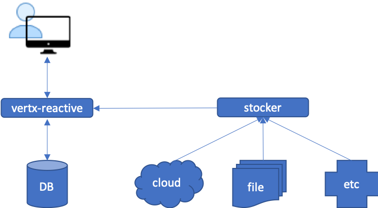

# samples
[vertx-reactive api](https://github.com/chiusday/samples/tree/master/vertx-reactive) returns stock prices based on the supplied ticker symbol. Internally, it will check if the price being queried is in it's database, if it is, then the prices are returned. Otherwise, it will call the [stocker](https://github.com/chiusday/samples/tree/master/stocker) API to pull the prices from sources (online/offline) that is transparent to vertx-reactive.

## Overview:

