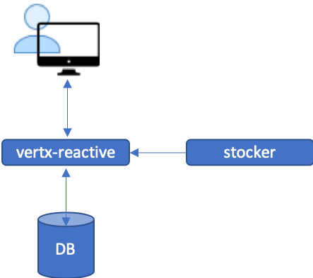

# vertx-reactive
This is a reactive version of multiple-tables project.
An API that returns stock prices based on the supplied ticker symbol. Internally, it will check if the price being queried is in it's database, if it is, then the prices are returned. Otherwise, it will call the [stocker](https://github.com/chiusday/samples/tree/master/stocker) API to pull the prices from sources (online/offline) which is transparent to vertx-reactive. Then save it in DB **asynchrously**, at the same time data is returned to the caller.

Data is stored, therefore this is more suitable to do analytics and other data manipulations as compatered to [stocker](https://github.com/chiusday/samples/tree/master/stocker)

## Overview:

